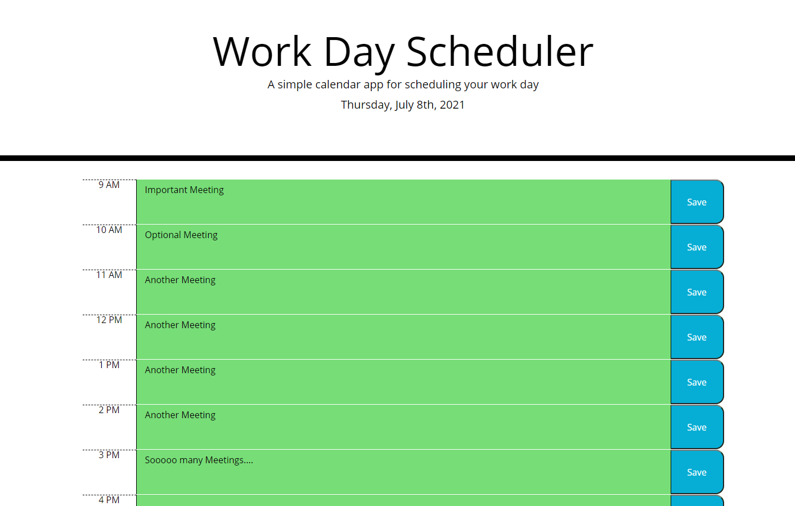

# day_planner
This is a simple day planner that allows the user to save a schedule locally. The background of the schedule will change colors depending on whether the time is in the past, present or future.The HTML and CSS was already supplied.

https://aabazary.github.io/day_planner/

